## 避難シミュレーション

### 前提条件
実際の避難を想定して、全員が同時に動き出すことはせず、班ごとに動き出す。
動き出しかたは、`Near`, `Far`, `Random`の3種類であり、`Near`, `Far`では、班は地域の近い人同士で固められており、それぞれ避難所に近い班、遠い班から動き出したことをシミュレートする。

> [!IMPORTANT]
> `Random`の場合は、地域の近い人同士で固めずに、ランダム抽出を行っているが、個人の散らばりを表しており、現実世界では、各々が気づき次第ばらばらに動き出したことを想定する。

### パラメータ
- **避難人数**: 可変
- **適用関数**: BPR関数($\alpha$: 1.919, $\beta$: 6.9373)
- **歩行速度**: 1.0, 1.25, 1.5 m/sの3から均等割合
- **時間間隔**: 0.1秒
- **待ち時間インターバル**: 3分(3分おきに1班の避難開始を行う)
- **避難開始バッチサイズ**: 25%(1班の人数は全体 $\times$ 0.25)

### 比較手法

- 比較手法(1,000人)
    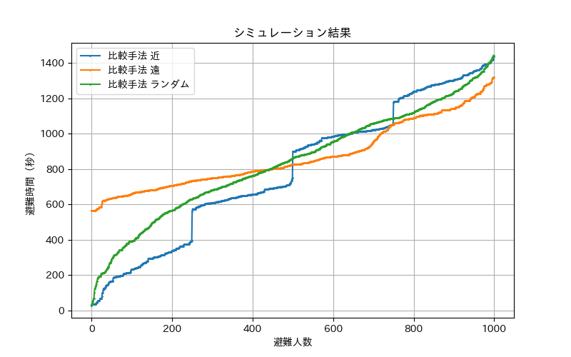

- 比較手法(1,500人)
    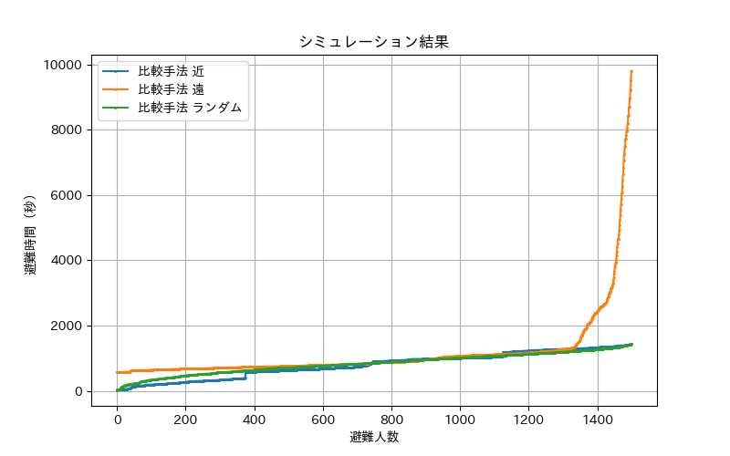

比較手法では、経路の再選択を行わず、経路の最短であるものを選択するのみなので、渋滞などを加味せず、渋滞している道でも進んでしまうため、渋滞が発生しやすい。特に、遠い順で移動した場合、近い班の移動開始タイミングと遠い班の避難所付近に差し掛かるタイミングの兼ね合いにより、より渋滞が起こりやすく、回避しない場合の影響が大きく出る。

### 時間拡大ネットワークを用いた提案手法

- 提案手法と比較手法の比較(1,000, 近い順)
    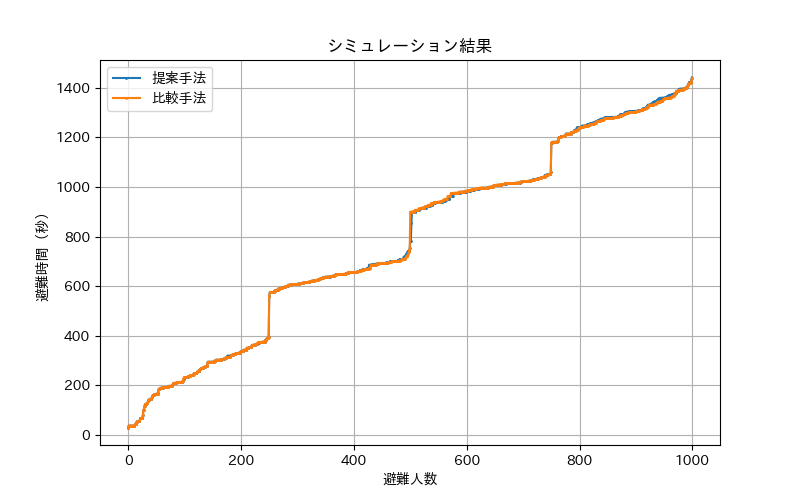

- 提案手法と比較手法の比較(1,000, 遠い順)
    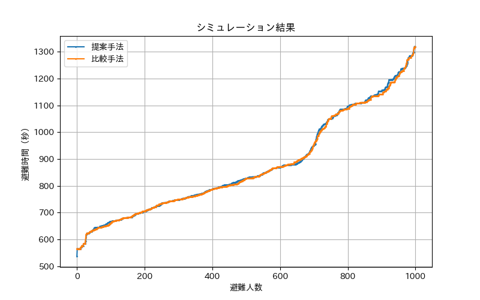

- 提案手法と比較手法の比較(1,500, 近い順)
    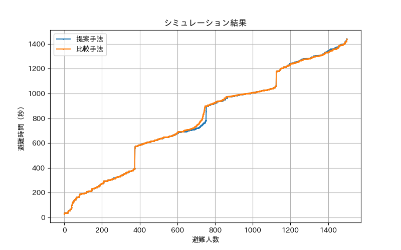

- 提案手法と比較手法の比較(1,500, 遠い順)
    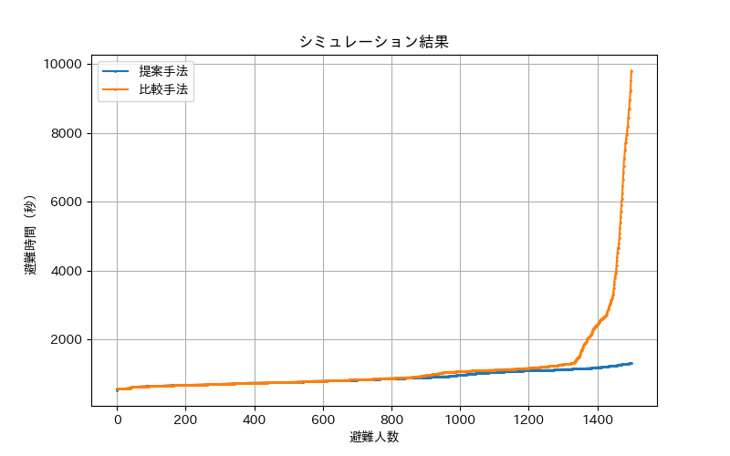

- 提案手法と比較手法の比較(1,800, 近い順)
    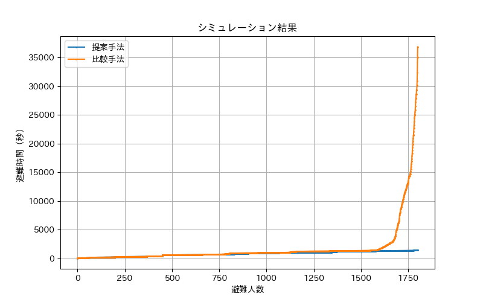

近い順では`1,800`、遠い順では`1,500`で大きな差が出た。差が出るのは、急な増加のときのみであり、それまでは、ほとんど同じ形のグラフとなっている。おそらく渋滞が発生し始める際に差がで始めると考えられる。

### 規模による避難時間

- 提案手法(1,000人)
    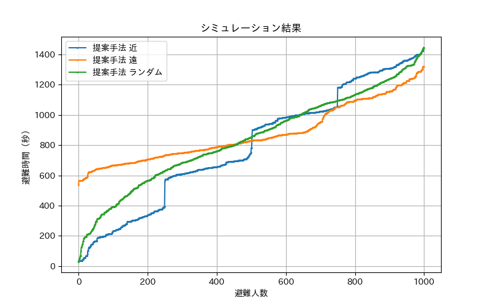

- 提案手法(2,000人)
    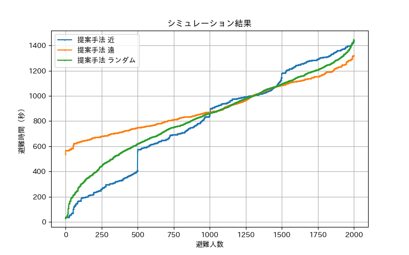

- 提案手法(3,000人)
    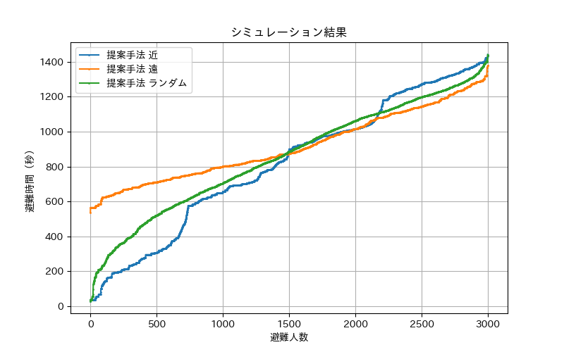

- 提案手法(4,000人)
    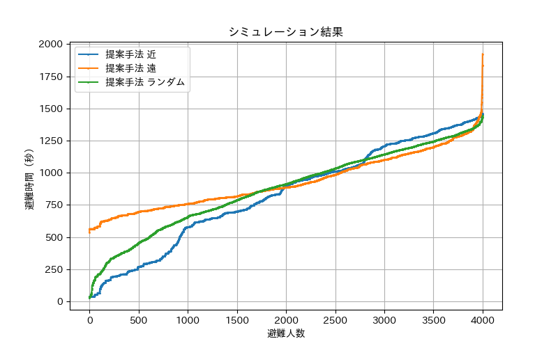

- 提案手法(5,000人)
    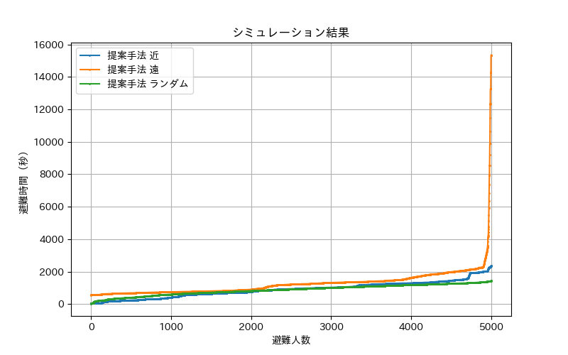

近い順で避難した場合、近い班がより早く避難所につくのに対して、遠い順で避難すると、最初に避難が完了する人が出始めるまで時間がかかる。
また、遠い順の4,000人あたりから、最後の避難者の避難完了が大幅に増加しているのは、最後の避難者が到着した時点で、すでに最適な経路がすべて渋滞しており、時間のかかる経路しか選択できなかったのが原因と考えられる。